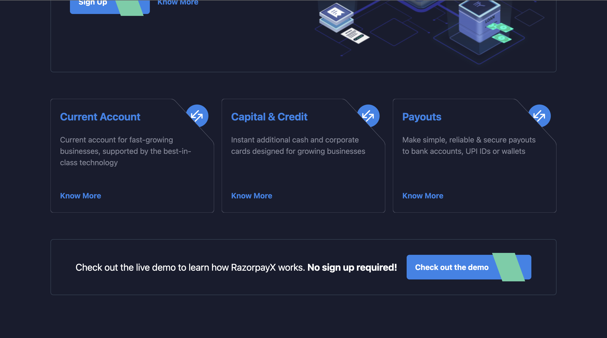
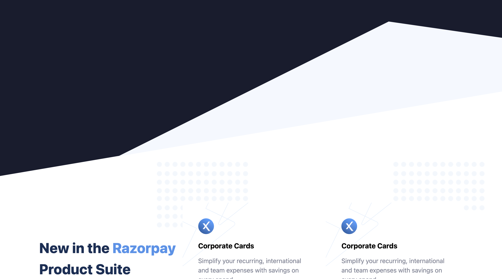
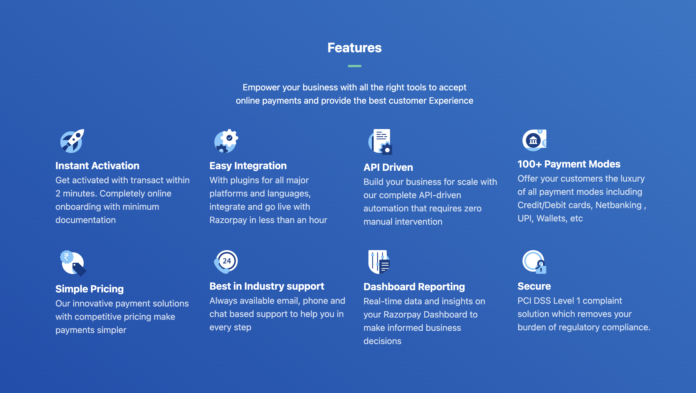
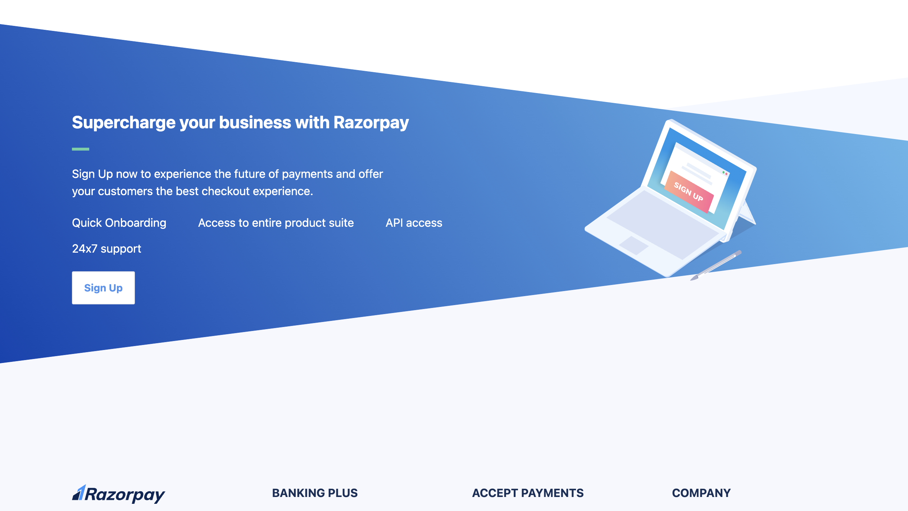

# 💳 Razorpay Clone (Frontend Only)

This is a **frontend-only clone of Razorpay's landing page**, built using **HTML, CSS, and Tailwind CSS**. The project replicates the design, layout, and responsiveness of the original Razorpay website, making it a great exercise for mastering layout and styling with Tailwind.

---

## 🎯 Purpose

The primary goal of this project is to practice and improve frontend development skills using **Tailwind CSS**, focusing on building a pixel-perfect and responsive UI without any JavaScript or backend functionality.

---

## ✨ Features

- 📐 Fully responsive layout
- 🎨 Pixel-perfect UI using Tailwind CSS utility classes
- 🧩 Replicates key sections: navigation bar, hero section, features, testimonials, pricing, footer, etc.
- 📱 Mobile-friendly design
- 💻 Clean and organized code structure

---

## 🛠️ Technologies Used

- **HTML5** – Semantic structure
- **Tailwind CSS** – Utility-first styling

---

## 🚀 Getting Started

To run this project locally:

1. Clone the repository:

```bash
git clone https://github.com/paveshkanungo/RazorPayClone.git
cd razorpay-clone
```

2. Then npm start

---

## 🌟 Screenshots

> 
> 
> 
> 
> 
> 
> 
> 
> 
> 
> 
> 

---

